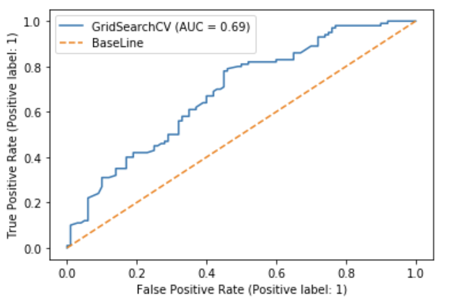
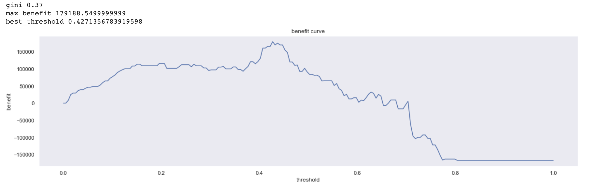

# GSB Data Science Practice

## Условия:
- **Задача**: Предсказать вероятность дефолта(PD) команий
- **Данные**: 32 395 объектов предоставлющие информацию о компаниях
- **Целевая метрика**: Accuracy
- **Вспомогательная метрика**: ROC-AUC

## Видео презентация и защиты решения:

https://user-images.githubusercontent.com/30021669/146678420-1d4bdbab-9c05-49f4-b938-944e04bab0e0.mov

## Последовательность работы с данными:
- Анализ данных
- Создание признаков, основываясь на анализе предметной области
- WOE-binning 
- Pipeline содержащий в себе:
  - SMOTE
  - StantardScaler
  - Logistic regression
- Интерпретация модели:
  - PDP-plots
  - Benefit-curve
  - Скоринговая карта
- Рекомендации:
  - Предложена метрика для оценивания модели после ее интеграции

## Результаты:
- **Accuracy**: 0.65
- **ROC-AUC**: 0.69
- **ROC-curve**:
  - 
- **Benefit-curve**:
  - 

## Библиотеки использованные в работе:
- pandas
- numpy
- matplotlib
- sklearn
- scipy
- pdpbox
- mlxtend
